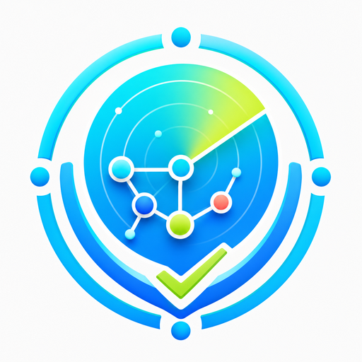
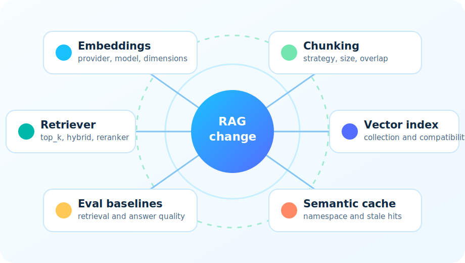
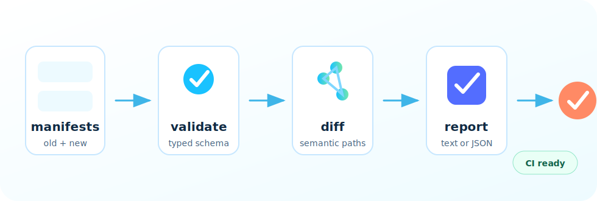

<p align="center">
  
</p>

<h1 align="center">rag-blast-radius</h1>

<p align="center">
  Pre-deploy safety checks for RAG changes.
</p>

<p align="center">
  
  
  
</p>

RAG systems hide a lot of state: document embeddings, vector indexes, semantic
caches, chunking settings, retrievers, rerankers, eval baselines, and prompt
assumptions. Change one piece and the others can quietly become stale.

`rag-blast-radius` makes those dependencies visible before deployment. It diffs
RAG manifests, shows what changed, and gives teams a small, reviewable artifact
for pull requests and release checks.

<p align="center">
  
</p>

## What It Helps Answer

- Did the embedding model, dimensions, or provider change?
- Did chunking change in a way that requires regenerated embeddings?
- Did a vector collection, semantic cache namespace, or eval baseline drift?
- Can a reviewer understand the RAG deployment risk without reading app code?
- Can CI get a stable JSON summary of the manifest diff?

## Current Status

The current CLI includes:

- starter manifest generation
- strict typed manifest validation
- deterministic manifest diffing
- text and JSON reports
- rule explanation metadata
- example manifests and tests

The richer deterministic risk engine, CI gating behavior, GitHub Action, and
framework integrations are tracked in [BUILD_PLAN.md](BUILD_PLAN.md).

## Install Locally

```bash
uv sync
uv run rag-blast --help
```

Without `uv`:

```bash
python -m pip install -e .
rag-blast --help
```

## Quickstart

Create a starter manifest:

```bash
rag-blast init
```

Compare two manifests:

```bash
rag-blast check --old old.json --new new.json
```

Emit machine-readable JSON:

```bash
rag-blast check --old old.json --new new.json --format json
```

Explain a rule:

```bash
rag-blast explain REEMBED_REQUIRED
```

Try an included example from a repo checkout:

```bash
rag-blast check \
  --old examples/openai_ada_to_3_large/old.json \
  --new examples/openai_ada_to_3_large/new.json
```

## How It Works

<p align="center">
  
</p>

1. Write down the current and proposed RAG state as manifests.
2. Validate both manifests with strict, typed schema checks.
3. Diff the manifests into stable paths such as `embedding.model`.
4. Render the result as readable text or JSON for automation.
5. Use rule explanations and the build plan to guide rollout checks.

## Example Report

```text
RAG BLAST RADIUS REPORT

Risk: UNASSESSED

Detected changes:
  - caches: [...] -> [...]
  - embedding.dimensions: 1536 -> 3072
  - embedding.model: text-embedding-ada-002 -> text-embedding-3-large
  - vector_store.collection: support_docs_v3 -> support_docs_v4

Current reports list raw manifest changes. Risk rules are added in later phases.
```

## Manifest Schema

`rag-blast-radius` centers on a RAG manifest. The default filename is
`.rag-manifest.json`.

```json
{
  "app": "customer-support-rag",
  "environment": "prod",
  "embedding": {
    "provider": "openai",
    "model": "text-embedding-ada-002",
    "dimensions": 1536
  },
  "chunking": {
    "strategy": "recursive_character",
    "chunk_size": 800,
    "chunk_overlap": 100
  },
  "vector_store": {
    "provider": "qdrant",
    "collection": "support_docs_v3"
  },
  "retriever": {
    "top_k": 8,
    "hybrid": false,
    "reranker": null
  },
  "caches": [
    {
      "type": "semantic_cache",
      "namespace": "support_rag_prod_v4",
      "embedding_model": "text-embedding-ada-002"
    }
  ],
  "evals": [
    {
      "name": "retrieval_golden",
      "path": "evals/retrieval_golden.jsonl"
    }
  ]
}
```

Validation catches missing required sections, empty strings, invalid numeric
values, stringified numbers or booleans, chunk overlaps that are not smaller
than chunk size, and unknown keys that are likely typos.

`retriever.reranker` can be `null` or an object with a required `model` and an
optional `provider`.

## Repository

The public repository name is `rag-blast-radius` and the CLI command is
`rag-blast`.
